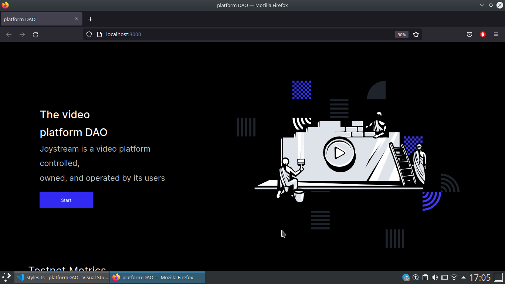

# plataform DAO

## 💻 Projeto

Aplicação de UI Clone da [Joystream](https://www.joystream.org/), que é uma plataforma de vídeo controlada,
de propriedade e operado por seus usuários

## 🌐 Preview

 
    
Tela de Home 

    

 

## 🚀 Tecnologias

Esse projeto foi desenvolvido com as seguintes tecnologias:

- React
- Typescript
